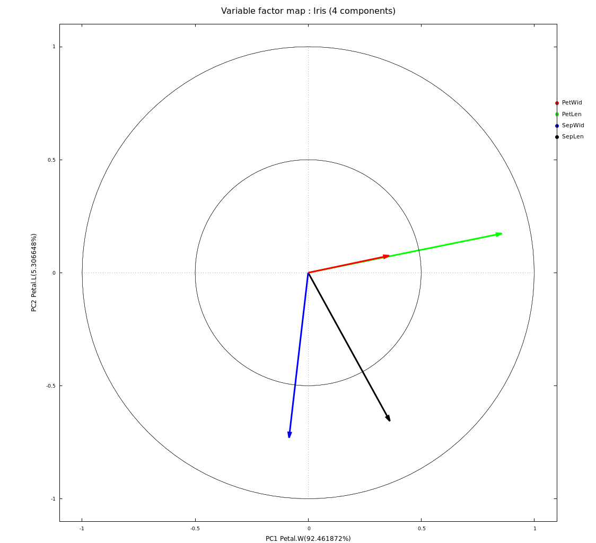
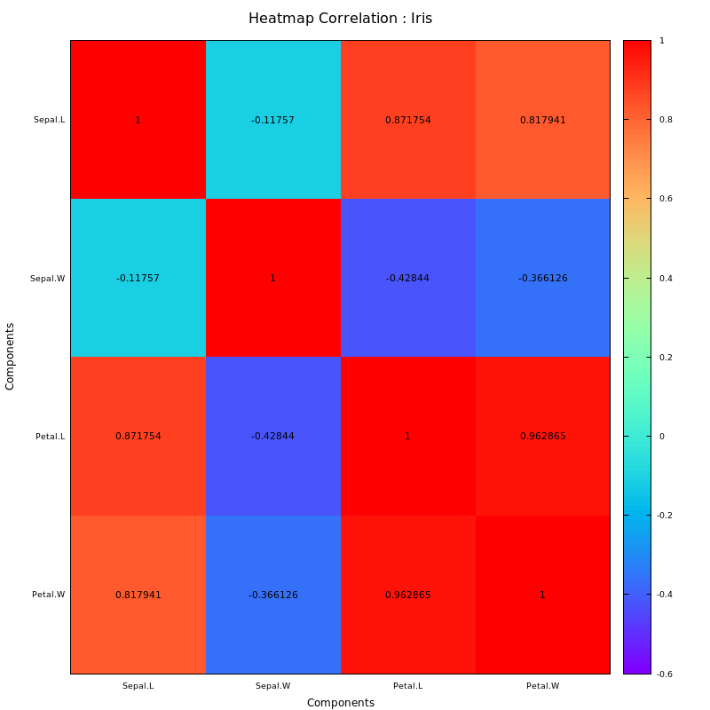
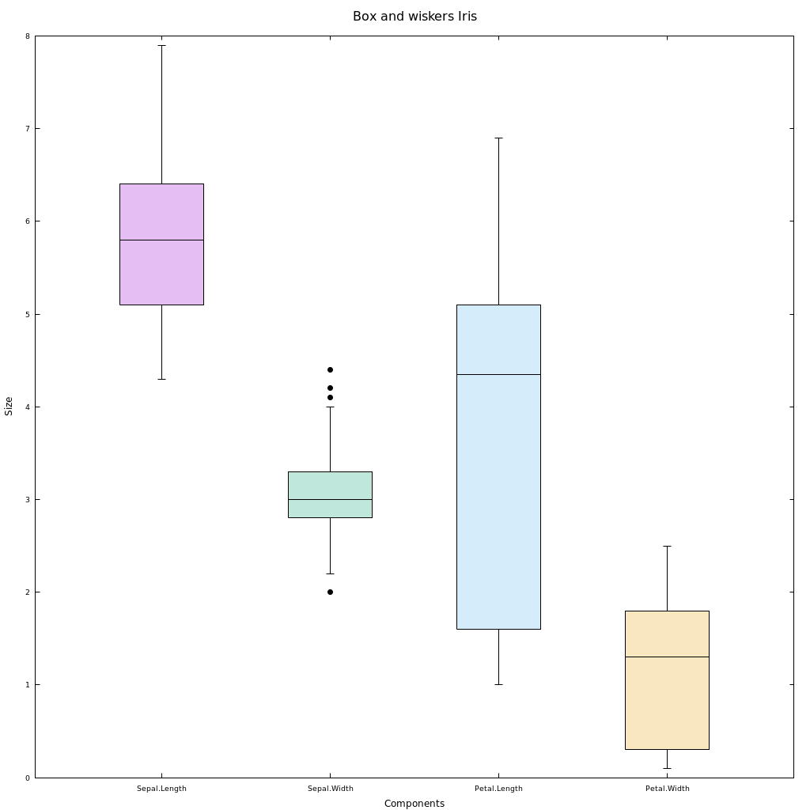

# Pca

May be you are familiar with spreadsheets and dynamic cross tables tools to compare columns behaviours as sum,means...but what happens if you have about a thousand columns, you will need a more synthetic view of your datas.  

**Pca**(Principal Component Analysis) is a method attached to Quantitative analysis (QA) branch.  

It performs multidimensional analysis (Rk space), considering "Components" as columns of a datasets.  

Behaviours are calculated as covariance or correlation and represented as 2d square matrix.   
Many of these features yet exists in Python modules, but python may be slow on wide datasets.


The c++ code is a backend to handle large datasets with a best time response.  
Python part [Docker image](./script/python/README.md) can be used to plot and or to crosscheck results directly or from the backend.  

[Matlab/Octave](./script/matlab/README.md) part is available to crosscheck, some 
scripts can be used to generate graphics.

## Toc
* :file_folder: [Purpose](#purpose)
* :file_folder: [Lexical](#lexical)
* :file_folder: [Features](#features)
* :file_folder: [Requirements](#requirements)
* :file_folder: [Pca explained](#pca-explained)
* :file_folder: [Check](#check)
* :file_folder: [Build](#build)
* :file_folder: [Run](#run)
* :file_folder: [Debug](#debug)
* :file_folder: [Sample output](#sample-output)
* :file_folder: [Testing](#testing)
* :file_folder: [Doc](#doc)

## Purpose

Demistify PCA to let exploration as simple as possible for c/c++ devs.

## Lexical

Pre-processing
* Covariance matrix is the dispersion matrix of a dataset.  
* Correlation matrix is a covariance scaled matrix (identified by diagonal set to 1).  

Svd (Single values decomposition) is the Eigen process.

Consider 2 forms of Pca
* covariance based  (Svd on unscaled matrix).
* correlation based (Svd on scaled matrix).

As you may notice 
* covariance is lossless with a wide dispersion.
* correlation is lossy with scaled dispersion.

:question: So what should I use cov or cor  
When using dataset with columns values of same units use covariance else use correlation.  
So method to use will depend on the nature of your dataset.

[:arrow_backward:](#toc)

## Features

### Demo

SpeciesDemo is semi-generic class starter.  
You can provide a filename as 1st argument to work on other file than "species.csv".  
In that case you must provide a class label (additional column in csv headers prefixed by #),  see csv samples like [bovinscat](script/matlab/bovinscat.csv),[winecat](script/matlab/winecat.csv).

### Calculus
* :triangular_ruler: [Covariance](src/pca.cpp)
* :triangular_ruler: [Correlation](src/pca.cpp)
* :triangular_ruler: [Pca basis](src/pca.cpp)
* :triangular_ruler: [Eigen values](src/pca.cpp)
* :triangular_ruler: [Eigen vectors](src/pca.cpp)
* :triangular_ruler: [Explained variance](src/pca.cpp)
* :triangular_ruler: [Projection](src/pca.cpp)

### Graphics
* :chart: [Scatter](#scatter)
* :chart: [Correlation circle](#correlation-circle)
* :chart: [Heatmap correlation](#heatmap-correlation)
* :chart: [Dataset boxes and wiskers](#dataset-box-and-wiskers)

### Exports
* :clipboard: Csv
* :clipboard: Json

## Pca explained

* [Introduction](https://www.youtube.com/watch?v=uV5hmpzmWsU)
* [Math explained PCA](https://www.youtube.com/watch?v=FgakZw6K1QQ)

Interpretation
* [Interprétation d'une ACP sur les variables (fr)](http://www.jybaudot.fr/Analdonnees/acpvarres.html)
* [L'analyse en composante principale (fr)](https://dridk.me/analyse-en-composante-principale.html)

Questions
 * [Best way to let pca be normalized (en)](https://stats.stackexchange.com/questions/53/pca-on-correlation-or-covariance)

Tools

* [Online Statistics Calculator (en)](https://datatab.net/statistics-calculator/factor-analysis)
* [Principal Component Analysis and Linear Discriminant Analysis with GNU Octave (en)](https://www.bytefish.de/blog/pca_lda_with_gnu_octave.html)

[:arrow_backward:](#toc)

## Fixtures & datasets

Preparing datasets is essential.  
Think about using some ETL (Extract Transform Load) before operating pca.  
I would recommend to read related content to **csvkit** (module included in docker image) :
* [Clean csv data](https://towardsdatascience.com/how-to-clean-csv-data-at-the-command-line-4862cde6cf0a) to filter relevant datas from a raw source.
* [10 csvkit commands](https://medium.com/codex/10-csvkit-commands-data-engineers-must-know-a91b34e182e8) you should know as data engineer.

Hereby
* [2x12 inline](src/main.cpp)
* [4x12 pop(gender/salary/age/weight) csv](script/matlab/gsaw.csv)
* [6x23 bovins(vif/carcasse/quality/total/gras/os) csv](script/matlab/bovin.csv)
* [4x150 iris species(sepallength/sepalwidth/petallength/petalwidth) csv](script/python/workspace/species.csv)

Sources  
* [Numerical Example](https://www.itl.nist.gov/div898/handbook/pmc/section5/pmc552.htm)
* [2x12 (age/weight)](https://datatab.net/statistics-calculator/factor-analysis)
* [bovins (@see above)](https://cermics.enpc.fr/scilab_new/site/Tp/Statistique/acp/acp.html)
* [iris species](https://datahub.io/machine-learning/iris/r/1.html)

## Requirements

* [CMake 3.22.1](https://cmake.org/). 
* C++ compiler, here g++, [howto change it](https://stackoverflow.com/questions/45933732/how-to-specify-a-compiler-in-cmake) in [CMakeLists.txt](CMakeLists.txt). 
* [Alglib](https://www.alglib.net) included in src. 
* [Boost 1.78.0](https://www.boost.org/), check CMakeList.txt to let cmake use the correct PATHS in the find_package. 
* [Gnuplot-iostream](https://github.com/dstahlke/gnuplot-iostream).
* [Octave](https://www.gnu.org/software/octave/) or [Matlab](https://mathworks.com/products/matlab.html).
* [Doxygen](https://www.doxygen.nl) for doc generation.

[:arrow_backward:](#toc)


## Check

```
./check.sh
```
[:arrow_backward:](#toc)

## Build

```
./build.sh
```
[:arrow_backward:](#toc)

## Run

Help usage
```
./build/pca --help
```
Demo species
```
./build/pca
```
Demo wine options dimension1 column 0, dimension2 column 5
```
build/pca script/matlab/winecat.csv --d1 0 --d2 5
```

[:arrow_backward:](#toc)

## Debug

### Gnuplot

```
GNUPLOT_IOSTREAM_CMD=">dbgscript.gp" ./build/pca
```
[:arrow_backward:](#toc)

## Sample output

Related to
* [iris species dataset](https://datahub.io/machine-learning/iris/r/1.html) input source.
* Python script [species.py](./script/python/workspace/species.py)

### Console

```
Fixture csv iris species 4x150
	Fixture Dataset

	5.100000	3.500000	1.400000	0.200000
	4.900000	3.000000	1.400000	0.200000
	4.700000	3.200000	1.300000	0.200000
	4.600000	3.100000	1.500000	0.200000
	5.000000	3.600000	1.400000	0.200000
	         ...
	Covariance

	0.685694	-0.042434	1.274315	0.516271
	-0.042434	0.189979	-0.329656	-0.121639
	1.274315	-0.329656	3.116278	1.295609
	0.516271	-0.121639	1.295609	0.581006

	Correlation

	1.000000	-0.117570	0.871754	0.817941
	-0.117570	1.000000	-0.428440	-0.366126
	0.871754	-0.428440	1.000000	0.962865
	0.817941	-0.366126	0.962865	1.000000

	Eigen vectors

	0.361387	-0.656589	0.582030	0.315487
	-0.084523	-0.730161	-0.597911	-0.319723
	0.856671	0.173373	-0.076236	-0.479839
	0.358289	0.075481	-0.545831	0.753657

	Eigen values

	4.228242	0.242671	0.078210	0.023835
	
	Explained variance
	
	0.924619	0.053066	0.017103	0.005212
	
	Projected matrix

	2.818240	-5.646350	0.659768	-0.031089
	2.788223	-5.149951	0.842317	0.065675
	2.613375	-5.182003	0.613952	-0.013383
	2.757022	-5.008654	0.600293	-0.108928
	2.773649	-5.653707	0.541773	-0.094610
	         ...
```
[:arrow_backward:](#toc)

### Graphics

#### Scatter

:question: [How can I interpret individual factor map](http://factominer.free.fr/reporting/Investigate_PCA.html)


[:arrow_backward:](#toc)

#### Correlation circle

:question: [How can I interpret variable factor map](http://factominer.free.fr/reporting/Investigate_PCA.html)


[:arrow_backward:](#toc)

#### Heatmap correlation 

:question: [How can I interpret correlation heatmap](https://www.statology.org/how-to-read-a-correlation-matrix/)


[:arrow_backward:](#toc)

#### Dataset box and wiskers

:question: [What does a box plot tell you](https://www.simplypsychology.org/boxplots.html)


[:arrow_backward:](#toc)

## Testing

```
./test.sh
```
[:arrow_backward:](#toc)

## Doc

From root project.

```
doxygen doc/pcasvd.doxygen
```

Doc will be generated in doc/html folder.

[:arrow_backward:](#toc)

## Todo

* Make gplot thread safe. 
* Improve gplotgeneric heatmap scale. 
* Remove #cat class from matrices. 

## Contribute

* Feel free to clone from master then pull request on your brand new branch.
* Pls, do not forget to rebase from master before push.

## Licence

* [GPL 3.0](LICENSE)
